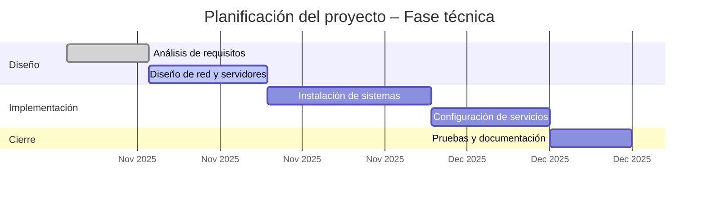

# Elaboración de una buena planificación temporal del proyecto

## 1. Qué es la planificación temporal

La **planificación temporal** consiste en **organizar en el tiempo las actividades** necesarias para llevar a cabo un proyecto, asignando a cada tarea una **duración**, un **orden de ejecución** y los **recursos** que necesita.

Su objetivo es **garantizar que el proyecto se realice de forma ordenada, eficiente y dentro de los plazos establecidos**.

---

## 2. Importancia de una buena planificación

Una buena planificación temporal permite:

* Visualizar el **orden lógico de las actividades**.
* Detectar **dependencias** entre tareas (qué debe hacerse antes o después).
* Asignar **recursos humanos y materiales** adecuadamente.
* Prevenir **cuellos de botella** o **retrasos**.
* Facilitar el **seguimiento y control** del proyecto (RA4).
* Mejorar la **comunicación** dentro del equipo.

---

## 3. Elementos básicos de la planificación

1. **Actividades** → tareas que deben realizarse.
2. **Duración** → tiempo estimado para completar cada actividad.
3. **Dependencias** → relaciones entre tareas (qué tarea depende de cuál).
4. **Recursos** → personas, equipos o materiales necesarios.
5. **Hitos** → puntos clave que marcan avances significativos (entregas, revisiones, pruebas, etc.).
6. **Calendario** → fechas concretas de inicio y fin de cada tarea.

---

## 4. Fases para elaborar la planificación temporal

### Identificar las actividades

Desglosa el proyecto en tareas concretas.
Ejemplo para un proyecto de infraestructura TI:

* Análisis de requisitos
* Diseño de red
* Montaje de servidores
* Configuración de servicios
* Pruebas y documentación

> Consejo: utiliza una estructura de desglose de trabajo para organizar las tareas jerárquicamente.

---

### Estimar la duración de cada actividad

Calcula cuántas horas o días se necesitarán.
Ten en cuenta:

* Experiencia previa.
* Dificultad técnica.
* Recursos disponibles.
* Posibles riesgos o imprevistos.

> **Técnica útil:** añadir un **margen de seguridad del 10–20%** a las tareas críticas.

---

### Determinar las dependencias

Algunas tareas **no pueden comenzar** hasta que otras se hayan completado.
Ejemplo:

* No se puede desplegar el servidor si antes no se ha instalado el sistema operativo.
* No se puede probar un servicio si no está configurada la red.

Tipos de relaciones comunes:

| Tipo                   | Descripción                               | Ejemplo                                |
| ---------------------- | ----------------------------------------- | -------------------------------------- |
| **Fin–Inicio (FS)**    | La tarea B comienza cuando termina la A.  | Instalar SO → Configurar servicios     |
| **Inicio–Inicio (SS)** | Las dos tareas comienzan al mismo tiempo. | Redacción y revisión de documentación  |
| **Fin–Fin (FF)**       | Terminan a la vez.                        | Pruebas de red y pruebas de servidores |

---

### Asignar recursos y responsables

Cada tarea debe tener **una persona o equipo responsable** y los **recursos** asignados:

* **Recursos humanos:** roles, horas disponibles.
* **Recursos materiales:** equipos, licencias, laboratorios virtuales.
* **Recursos económicos:** costes asociados.

---

### Representar gráficamente el calendario

El formato más habitual es el **diagrama de Gantt**, que muestra:

* Tareas en el eje vertical.
* Tiempo en el eje horizontal.
* Barras que indican duración, dependencias y progreso.

Ejemplo simplificado:

Tenéis otro ejemplo en la rama de mi proyecto de ejemplo.

---

### Identificar hitos y puntos de control

Los **hitos** son fechas clave del proyecto, como:

* Finalización del diseño.
* Entrega del prototipo funcional.
* Revisión intermedia con el tutor.
* Cierre y presentación final.

Deben reflejarse en el Gantt o en una tabla de control.

---

### Validar y ajustar el plan

Una vez diseñado el plan:

* Comprueba que los plazos sean **realistas**.
* Ajusta la carga de trabajo de cada persona.
* Revisa las **dependencias críticas**.
* Confirma la disponibilidad de recursos y laboratorios.

---

## 5. Herramientas útiles

* **Trello / GitHub Projects:** para gestión visual de tareas.
* **GanttProject / TeamGantt:** para elaborar diagramas Gantt.
* **Excel / Google Sheets:** para tablas de planificación sencilla.
* **ProjectLibre o MS Project:** para proyectos más complejos.
* **Mermaid en Markdown:** ideal para proyectos documentados en GitHub (yo uso mermaid para los gantt, hay generadores online).

---

## 6. Buenas prácticas

- Prioriza tareas críticas (aquellas que condicionan el resto).
- Evita solapamientos innecesarios.
- Revisa el plan cada semana o fase.
- Documenta los cambios en un registro de control.
- Actualiza los hitos alcanzados.
- Mantén comunicación constante con el equipo y el tutor.

---

## 7. Relación con la evaluación (RA3 y RA4)

Una **planificación temporal bien elaborada** demuestra que el alumno:

* **Secuencia correctamente** las actividades (RA3.a).
* **Determina recursos y logística** (RA3.b).
* **Prevé riesgos y tiempos de ejecución** (RA3.e y RA3.f).
* Y permite el **seguimiento y control del progreso** (RA4.a–RA4.d).