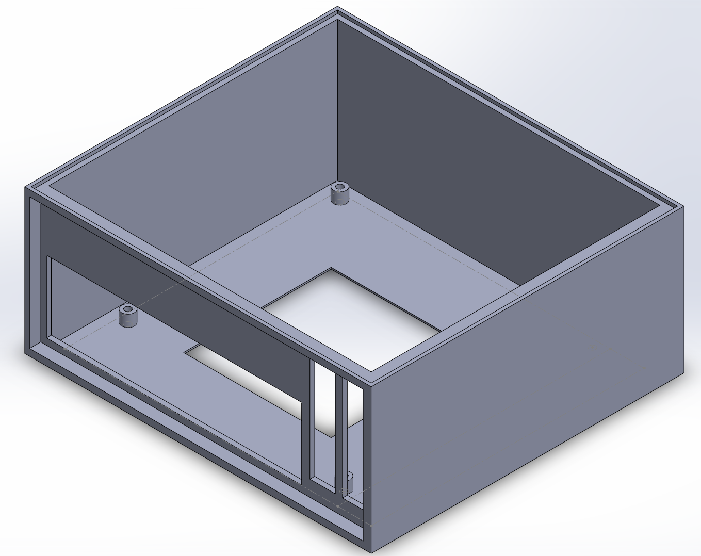
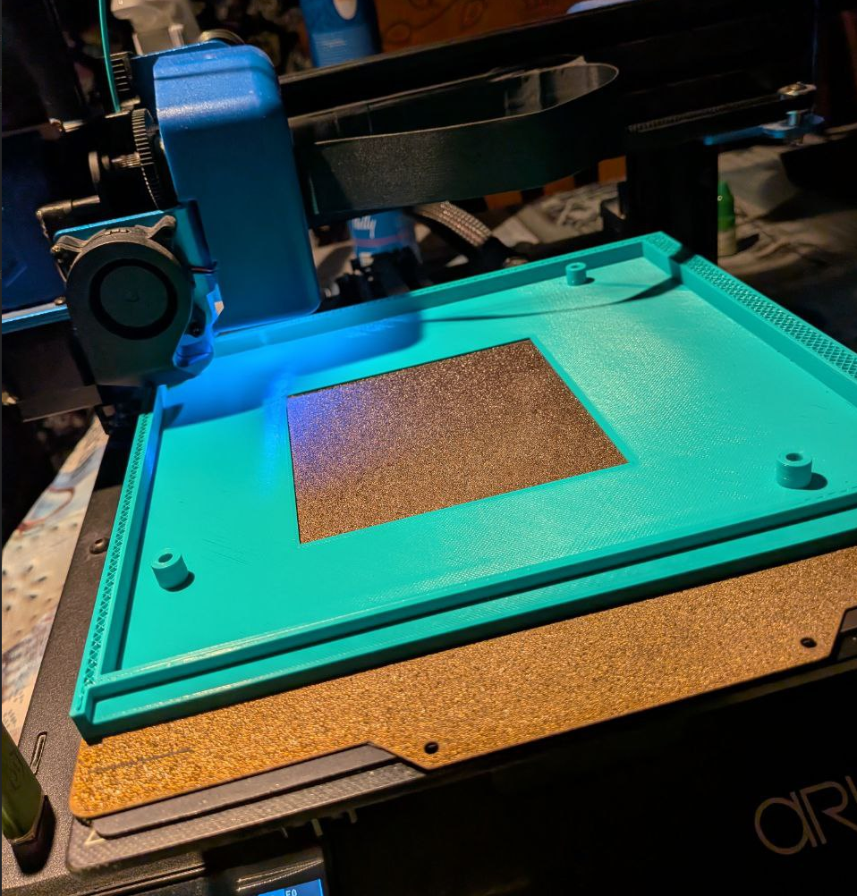
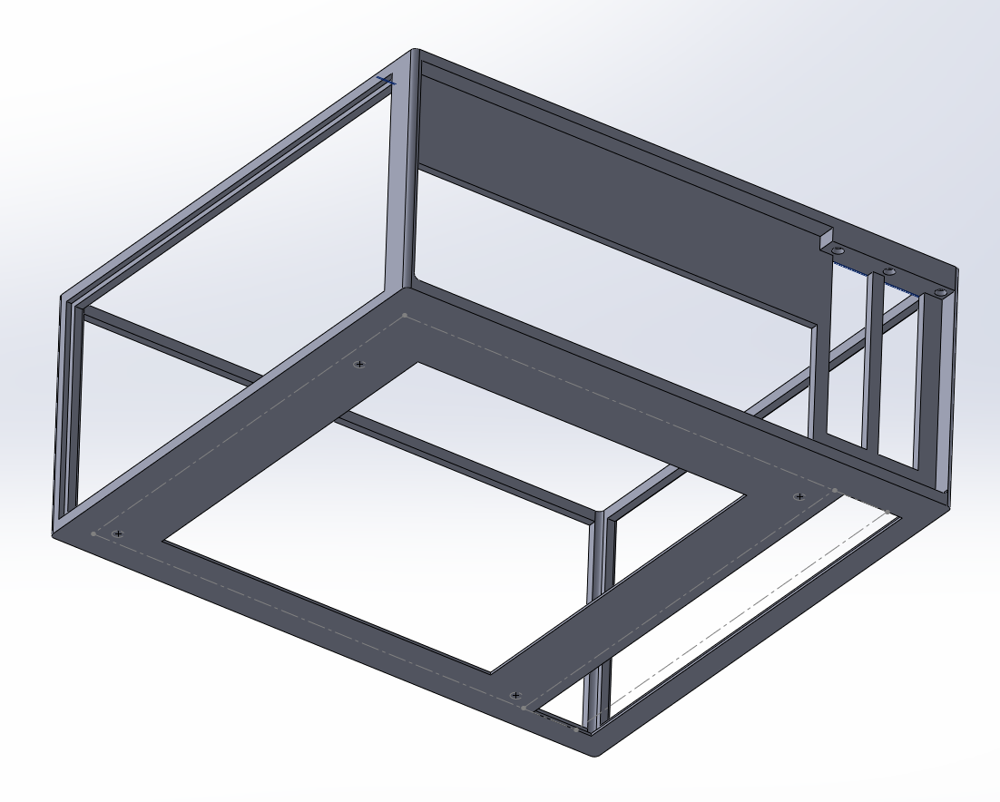
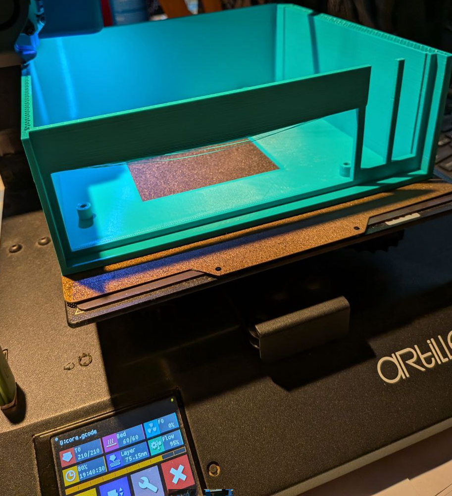

# Diario de sesiones

## 27 de octubre
- Búsqueda de blueprints para dimensiones de placas
- Parece que está claro que tengo que usar placas mini-itx
- Creía que encontrar los planos iba a ser más sencillo, pero parece que no.
- Protocase: How to design custom enclosures for motherboards.pdf
- Biostar h61mhv2 es una micro-atx casi compatible con mini-itx. Si hacemos la caja un pelín más grande nos sirve para el prototipo.
- Área de impresión 220x220x300
- Dimensiones mini-itx 170x170
- Dimensiones biostar 170x190
- Primer diseño con dos slots PCIe

**Tiempo total**: 4 horas (2 de ellas mientras veía la F1)

**Tarea en segundo plano**: impresión del diseño inicial

**Siguiente paso**: evaluar el software

## 28 de octubre
- Detectados algunos problemas en la impresión:
    - Tiempo de impresión demasiado largo sólo para prototipar (actualmente 19h, capa 75mm)
    - Hay que poner soportes a los puentes de la ranura I/O de la placa
    - Soporte a tuercas para PCIe
    - Ranura de inserción de PCIe y chapa I/O
- He creado problemas de estabilidad de impresión y probablemente de resistencia del chasis (core.v2):
    - El objetivo es reducir los tiempos de impresión
    - Habrá que solucionarlos más adelante

**Tiempo total**: 1 hora

**Tarea en segundo plano**: impresión del diseño inicial

**Siguiente paso**: evaluar el software

## Hasta el 12 de noviembre
- El diseño inicial de la segunda carcasa (PSU + discos) se vió interrumpido por un corte de luz. Recordad guardar el diseño cada X tiempo, menudo error de novato.
- Fallo en los rodamientos lineales de la impresora. He comprado los respuestos y ya me han llegado, pero no he tenido tiempo de desmontar la máquina y repararla.
- Recibidos los insertos metálicos para las roscas, métrica 3.
- Mejorado el diseño para facilitar la inserción de PCIe.
- Elaborada una lista del software de almacenamiento

**Tiempo total**: muchos ratos sueltos, unas 3 horas en total en las últimas dos semanas.

**Siguiente paso**: consolidar la evaluación del software.

## 12 de noviembre
- Comparativa documental de las soluciones software para infraestructura y aplicación de almacenamiento.
- Queda mejorar la redacción, que no la he puesto bonita.

**Tiempo total**: 1,5 horas

**Siguiente paso**: evaluar el hardware

## 25 de noviembre
- Comparativa entre diferentes soluciones hardware
- Queda: añadir más, incluir PSUs, incluir discos

**Tiempo total**: 1,5 hroas

**Siguiente paso**: continuar evaluación hardware