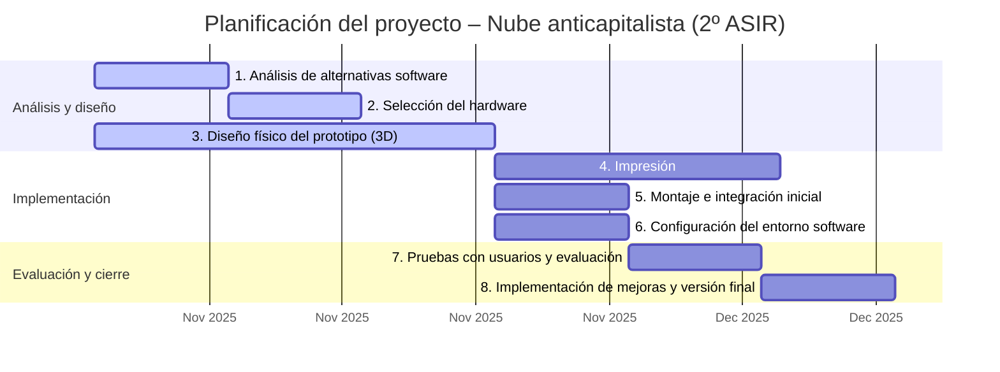

# Proyecto de ejemplo 2º ASIR

## Reflexiones pre-proyecto: mi idea
### Descripción del problema
Tengo varios amigos que utilizan servicios en la nube de terceros para guardar copias de seguridad de sus archivos y poder acceder a ellos fácilmente desde cualquier lugar o dispositivo. Sin embargo, estos servicios suelen formar parte de un ecosistema bastante intrusivo, con limitaciones importantes en materia de privacidad y el horripilantemente horrible pago mensual de la enésima cuota que, aunque pequeña, se suma a una lista interminable de suscripciones.

Además, estamos cansados. Hoy el servicio funciona bien, y mañana llega Google, Amazon o Microsoft con nuevas condiciones, limitaciones o supuestas mejoras (que nadie quiere). Cada día pagamos un poco más por servicios que ofrecen un poco menos, y la alternativa en un mundo donde la única métrica es, aparentemente, el beneficio económico, aún no ha llegado.

En este proyecto, me planteo plantar cara al avaricioso enemigo capitalista con una solución *budget-friendly*, *low-maintenance* y (casi) totalmente *DIY*: un sistema de almacenamiento *self-hosted* que permita a cada uno tener su propia nube.

Y no, los términos en inglés no son necesarios. Era solo por hacerme el chulo :3

### Cómo quiero solucionar el problema
- Un pequeño servidor (el tamaño importa, cracks) que no haga apenas ruido ni consuma mucho.
- Sólo compraremos aquellas piezas que no podamos fabricar.
- Debe ser auto-mantenible pero seguro.
- Debe ser extremadamente fácil de usar.
- ~~Opcional: debe ser federado.~~ Nada, esto fuera

### Qué voy a hacer 
- Diseñar una caja para imprimir en 3D.
- Buscar hardware lo más ~~económico~~, pequeño y eficiente posbile. (Nota: esto empieza a no ser nada económico en comparación con solucione ya existentes)
- Buscar una solución software que me permita la mayor seguridad con la menor interacción humana.
- NO VENDERLO JAMÁS.

### ¿De cuánto tiempo dispongo?
Me gustaría obtener una primera versión funcional del proyecto en 2 meses. Dispongo de unas 2 horas semanales (formales) y de muchos ratos sueltos. Puedo priorizar las tareas más serias para las 2 horas formales y aprovechar los momentos sueltos de tiempo libre para realizar investigaciones de posbile software o hardware. Estimo que lo más complicado será el diseño de la caja en 3D.

## Descripción formal del proyecto
### Objetivos
1. Analizar distintas soluciones de almacenamiento autogestionado (Nextcloud, Seafile, Pydio, Syncthing, entre otras), evaluando sus requisitos técnicos, ventajas y limitaciones, con el fin de seleccionar la opción más adecuada al contexto del proyecto.

2. Seleccionar el conjunto de hardware más apropiado, priorizando la eficiencia energética, el bajo coste y la compatibilidad con la solución software elegida.

3. Diseñar una carcasa modular imprimible en 3D adaptada al hardware seleccionado, optimizada para un montaje sencillo, buena ventilación y tamaño reducido.

4. Ensamblar un prototipo funcional que permita realizar pruebas de integración y obtener retroalimentación de los posibles usuarios.

5. Configurar *stack* software sencillo y coherente, compuesta por el menor número posible de herramientas autocontenidas y listas para su uso inmediato.

6. Recoger las opiniones de los usuarios tras un periodo de prueba de dos semanas y elaborar una lista priorizada de mejoras.

7. Implementar las mejoras identificadas y generar la primera versión estable del producto final.

### Evaluación de los objetivos

| Nº    | Objetivo           | Métricas                                                                                   |
| ----- | -------------------| ------------------------------------------------------------------------------------------ |
| **1** | Software principal | <ul><li>Nº de soluciones analizadas (≥3)</li><li>Informe comparativo con tabla de decisión</li><li>Justificación documentada de la elección final</li></ul>    |
| **2** | Hardware           | <ul><li>Coste total del hardware (€)</li><li>Consumo eléctrico medido (W)</li></ul>                                                                            |
| **3** | Caja 3D            | <ul><li>Modelo 3D funcional</li><li>Nº de iteraciones de diseño realizadas</li></ul>                                                                           |
| **4** | Prototipo          | <ul><li>Prototipo operativo (sí/no)</li><li>Nº de pruebas de integración superadas</li><li>Tiempo medio de montaje (min)</li></ul>                             |
| **5** | Stack software     | <ul><li>Nº total de servicios o paquetes instalados</li><li>Tiempo de despliegue completo (min)</li></ul>                                                      |
| **6** | Evaluación         | <ul><li>Nº de usuarios participantes</li><li>Valoración media de satisfacción (escala 1–5)</li><li>Nº de sugerencias recibidas y priorizadas</li></ul>         |
| **7** | Release            | <ul><li>Nº de mejoras implementadas (%)</li><li>Estabilidad del sistema (uptime > 95 %)</li><li> Validación del usuario final (aprobación ≥ 80 %)</li></ul>    |

## Planificación

## Objetivo 1: Análisis de las alternativas
Existen numerosas alternativas en el mercado que dan soporte a un espacio de almacenamiento privado a través de la red. A continuación, analizaremos las diferentes soluciones para infraestructura (virtualización y/o contenedores) y el software de almacenamiento y sincronización.

### Infraestructura

- **Proxmox VE**
  - **Licencia:** AGPLv3 (libre)  
  - **Soporte:** Máquinas virtuales y contenedores
  - Plataforma integral con gestión web, soporte de clústeres, copias de seguridad integradas y alta disponibilidad. Permite combinar máquinas virtuales completas con contenedores ligeros en un mismo entorno.

- **oVirt / Red Hat Virtualization**
  - **Licencia:** GPLv2 (libre)  
  - **Soporte:** Máquinas virtuales
  - Basado en KVM, permite administrar múltiples hosts y recursos desde una consola centralizada. Entornos empresariales, soporte comercial.

- **XCP-ng**
  - **Licencia:** GPLv2 (libre)  
  - **Soporte:** Máquinas virtuales
  - Versión libre del hipervisor Citrix.

- **OpenNebula**
  - **Licencia:** Apache 2.0 (libre / comercial)  
  - **Soporte:** Máquinas virtuales y contenedores  
  - Plataforma ligera para gestionar infraestructuras híbridas (on-premise, edge o cloud). Compatible con KVM, LXD y microVMs.

- **OpenStack**
  - **Licencia:** Apache 2.0 (libre)  
  - **Soporte:** Máquinas virtuales y contenedores
  - Ecosistema modular que permite construir nubes privadas o públicas. Incluye servicios de cómputo, red, almacenamiento e identidad. Complejo.

- **VMware vSphere / ESXi**
  - **Licencia:** Comercial (propietario)  
  - **Soporte:** Máquinas virtuales  
  - Estándar empresarial consolidado. Ofrece alta disponibilidad, migración en caliente y gestión distribuida de recursos. Coste elevado.

- **Docker Engine sobre Linux**
  - **Licencia:** Apache 2.0 (libre)  
  - **Soporte:** Contenedores  
  - Plataforma ligera de virtualización a nivel de sistema operativo. Permite desplegar aplicaciones aisladas y reproducibles. Fundamental para entornos DevOps, testing y microservicios. Amplísima comunidad (jeje).

- **KVM (Kernel-based Virtual Machine)**
  - **Licencia:** GPL (libre, integrada en el núcleo Linux)  
  - **Soporte:** Máquinas virtuales  
  - Tecnología de virtualización nativa del kernel de Linux, utilizada como base por muchas otras soluciones ya mencionadas. Ofrece gran rendimiento y compatibilidad. Trabajar a bajo nivel nos daría más control y podríamos tener virtualizaciones más livianas.

- **LXC / LXD**
  - **Licencia:** Apache 2.0 (libre)  
  - **Soporte:** Contenedores del sistema  
  - Contenedores de sistema completos gestionados desde Linux. Permiten entornos aislados con rendimiento cercano al *bare metal*, ideales para pruebas y entornos de laboratorio.

La decisión entre las alternativas ha de responder a los siguientes criterios:

- **Licencia:** preferimos soluciones libres o de código abierto que permitan independencia tecnológica sin costes de licencia.  
- **Escalabilidad y simplicidad:** capacidad de adaptarse a un entorno en crecimiento (aunque aparentemente homogéneo, ya veremos) sin amplias complicaciones técnicas.  
- **Integración con contenedores:** soporte nativo o complementario de tecnologías como Docker o LXC para servicios ligeros.  
- **Comunidad y soporte:** existencia de documentación amplia, foros activos y actualizaciones frecuentes.  

La evaluación de las propuestas es la siguiente:

//TO-DO Mejorar la redacción, está muy esquemático

- **Proxmox VE** licencia libre, escalable, soporte a KVM y LXC, amplia comunidad.
- **VMware vSphere / ESXi** licencia comercial, coste elevado.
- **OpenStack** libre, escalable, excesivamente complejo.
- **oVirt** libre (aunque con soporte comercial), escalable, menos comunidad que Proxmox.
- **OpenNebula** licencia libre, en crecimiento. Complejo.
- **KVM** y **LXC/LXD** son excelentes como base, pero requieren configuración manual o capas adicionales de gestión para un uso productivo. Cumple todos los requisitos, salvo la simplicidad.  
- **Docker** libre, escalable, amplia comunidad, soluciones *pre-made*, sólo contenedores.

### Almacenamiento y sincronización

- **Nextcloud**
  - **Licencia:** AGPLv3 (libre)  
  - **Características:** Sincronización de archivos, edición colaborativa, videollamadas, calendarios, tareas y autenticación centralizada.  
  - **Ventajas:** Amplia comunidad, soporte activo y ecosistema de aplicaciones muy extenso. Fácil integración con LDAP, SSO y Docker.  
  - **Inconvenientes:** muchísimo mantenimiento, esto da problemas hasta los días de fiesta cuando nadie lo usa. Entre otros inconvenientes, tenemos también MUCHO MANTENIMIENTO me tiene harto.

- **ownCloud**
  - **Licencia:** AGPLv3 / Comercial  
  - **Características:** Más o menos lo mismo.
  - **Ventajas:** Estabilidad y soporte empresarial opcional.  
  - **Inconvenientes:** Ecosistema más cerrado tras el fork de Nextcloud y menor compatibilidad con plugins comunitarios. Mismo perro, otro collar.

- **Seafile**
  - **Licencia:** GPLv2 / Comercial  
  - **Características:** Sincronización basada en bloques, cifrado de extremo a extremo y clientes ligeros para escritorio y móvil.
  - **Ventajas:** Gran rendimiento en redes lentas y con archivos voluminosos.  
  - **Inconvenientes:** Ecosistema más limitado y menor integración con herramientas externas.  

- **Syncthing**
  - **Licencia:** MPL 2.0 (libre)  
  - **Características:** Sincronización descentralizada entre dispositivos, sin servidor central.  
  - **Ventajas:** Privacidad total, cifrado TLS y transferencia directa entre nodos.  
  - **Inconvenientes:** No dispone de interfaz colaborativa ni de gestión centralizada.
  //CHECK: ¿Hay que sincronizar todo siempre?

- **Copyparty**
  - **Licencia:** MIT (libre)  
  - **Características:** Servidor web de archivos ligero y autónomo, con subida y descarga directa desde el navegador.  
  - **Ventajas:** Extremadamente fácil de desplegar, sin dependencias externas ni bases de datos. Video en youtube muy chulo `15_-hgsX2V0`.  
  - **Inconvenientes:** No incluye sincronización automática ni gestión de usuarios avanzada.  

- **OpenCloud**
  - **Licencia:** Apache 2.0 (libre)  
  - **Características:** Plataforma moderna de almacenamiento y compartición autogestionada. Basada en **Go (backend)** y **Vue.js + TypeScript (frontend)**. Ofrece WebDAV, API REST y gRPC, clientes de escritorio y móviles, búsqueda de texto completo, OCR y control de versiones.  
  - **Ventajas:** Interfaz limpia y rápida, alta eficiencia incluso en hardware ligero (como Raspberry Pi), instalación sencilla mediante Docker Compose, y enfoque en privacidad y soberanía de datos.  
  - **Inconvenientes:** Proyecto reciente, con documentación aún en desarrollo y ecosistema más joven que Nextcloud.

Se valoran los siguientes aspectos de las soluciones software propuestas:

- **Autonomía:** control total sobre los datos.  
- **Integración:** compatibilidad con autenticación centralizada y despliegue Docker.  
- **Usabilidad:** interfaz moderna y clientes multiplataforma.  
- **Eficiencia:** rendimiento y consumo de recursos.  
- **Madurez:** estabilidad del proyecto y frecuencia de actualizaciones.  
- **Comunidad:** documentación y soporte colaborativo.  
- **Necesidad de mantenimiento:** carga de administración, actualizaciones y soporte continuo.

Comparativa: //TODO mejorar este párrafo, y la estructura de evaluación por criterio me parece más limpia que la de arriba (evaluación por producto). Cambiar en infraestructura

- **Autonomía:**  
  Todas las soluciones son autogestionables. //TODO: por consiguiente, este no es un criterio últil

- **Integración:**  
  **Nextcloud** sobresale por su compatibilidad con LDAP, SSO, Docker y herramientas de colaboración. **OpenCloud** también ofrece integración moderna mediante APIs REST/gRPC, aunque con un ecosistema más limitado. **Seafile** y **ownCloud** requieren configuraciones adicionales, y **Syncthing** carece de integración central.

- **Usabilidad:**  
  **Nextcloud** y **OpenCloud** ofrecen las interfaces más limpias y completas para usuarios finales. **Seafile** es eficiente pero más técnico, mientras que **Syncthing** y **Copyparty** se orientan a usuarios avanzados o tareas puntuales sin entorno colaborativo.

- **Eficiencia:**  
  **Seafile** logra el mejor rendimiento en sincronización y uso de ancho de banda. **OpenCloud** es notablemente eficiente incluso en hardware limitado. **Nextcloud** juega a su propio juego.

- **Madurez:**  
  **Nextcloud** es la plataforma más consolidada y documentada. **ownCloud** conserva estabilidad pero menor impulso comunitario. **OpenCloud** se encuentra en expansión y aún en maduración, mientras que **Seafile** mantiene un desarrollo activo y predecible.

- **Comunidad:**  
  **Nextcloud** lidera con una comunidad muy amplia, seguida por **Seafile** y **Syncthing**. **OpenCloud** tiene una base creciente pero todavía reducida, al ser un proyecto más reciente.

- **Necesidad de mantenimiento:**  
  **Nextcloud** requiere mayor esfuerzo de administración (actualizaciones, copias de seguridad y monitorización). Presenta muchísimos errores con subidas grandes (gran cantidad de ficheros) o altas transferencias (ficheros pesados). Múltiples errores en la app de Android. Incompatibilidad aleatoria con algunos navegadores.  
  **OpenCloud** se encuentra en pleno crecimiento y será más propenso a necesitar mantenimientos.
  **Seafile** y **ownCloud** mantienen un nivel medio, mientras que **Syncthing** y **Copyparty** apenas demandan mantenimiento.

//TODO mejorar el tono de toda esta sección
Aunque **Nextcloud** es aparentemente la mejor solución, nuestra experiencia previa es NI CON UN PALO y por consiguiente voy a elegir OpenCloud. Me la juego, a ver qué pasa.

### Conclusión
Añadir conclusión de la decisión del stack de software.

## Objetivo 2: análisis del hardware
Hay una gran cantidad de alternativas de hardware que nos permite llevar a cabo este proyecto. Para el producto piloto, se utilizará el hardware ya disponible. No obstante, la selección del equipo final se llevará a cabo teniendo en cuenta los siguientes criterios:

- **Consumo energético** Vatios en reposo y en carga, eficiencia de la fuente y coste anual estimado.

- **Puertos SATA** Número total, soporte RAID por hardware (opcional).

- **Tipo de RAM** DDR3/DDR4/DDR5, ECC o no-ECC, DIMM o SO-DIMM, capacidad máxima y posibilidades de ampliación.

- **Puertos de red** Número de interfaces, velocidades disponibles (1G/2.5G/10G), compatibilidad LACP y estabilidad de drivers en Linux/BSD.

- **Puertos M.2** Cantidad, tipo NVMe.

- **Arquitectura x86_64** Para maximizar la compatibilidad.

- **Precio** Coste inicial del hardware y ampliaciones; relación precio/rendimiento.

- **Comunidad** Disponibilidad de documentación, guías y foros activos.

- **Factor de forma (ITX o inferior)** Tamaño físico, compatibilidad con chasis compactos, limitaciones térmicas y de expansión (slots PCIe, número de módulos RAM).

Lista de hardware relevante:

**1. CWWK NAS Motherboard Mini-ITX**  
**Precio:** ~259,31 €  
**Enlace:** amazon B0F9TV5SRV  
**Criterios:**  
Consumo: 6W
SATA: 8 puertos a través de SFF-8643
RAM: SO-DIMM DDR5
Red: 1x 10Gbps + 2x 2.5Gbps
M.2: doble NVMe  
x86_64: ntel N150    
Comunidad: solución estándar
Factor forma: Mini-itx
PCIe: PCIe x4

**2. PeeliCeeli N100 DDR5 Mini-ITX Low-Power**  
**Precio:** ~206,90 €  
**Enlace:** amazon B0DK2S8LRJ
**Criterios:**  
Consumo: 6W
SATA: 6 puertos nativos
RAM: DDR5 SO-DIMM  
Red: 4x 2.5Gbps
M.2: doble NVMe
x86_64: intel N100  
Comunidad: solución estándar
Factor forma: Mini-itx 
PCIe: PCIE x4

**3. LattePanda**  
**Precio:** Diferentes según placa, la sigma ~500 €
Está pensada para otros usos. Puede usarse como NAS pero cara en comparación a las anteriores.

**4. UGREEN NAS**  
**Precio:** ~279 € según modelo  
**Enlace:** amazon B0D2K9J5TY
**Criterios:**  
Consumo: 6W
SATA: 2 bahías, máx 76TB
RAM: 8GB (máx 16)
Red: 2.5Gbe
M.2: doble NVMe
x86_64: intel n100
Comunidad: en crecimiento, el hardware no es estándar
Factor forma: NAS compacto y completo, PSU externa
PCIe: sin PCIe