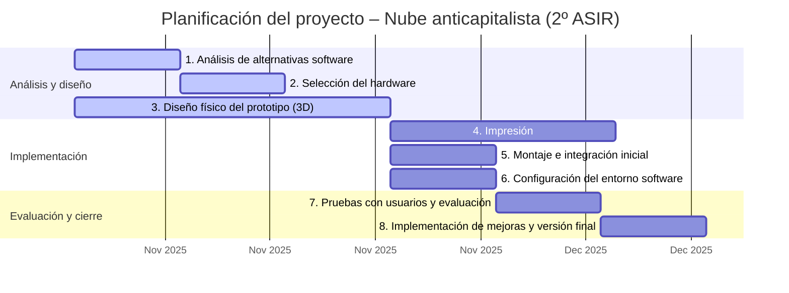

# Proyecto de ejemplo 2º ASIR

## Reflexiones pre-proyecto: mi idea
### Descripción del problema
Tengo varios amigos que utilizan servicios en la nube de terceros para guardar copias de seguridad de sus archivos y poder acceder a ellos fácilmente desde cualquier lugar o dispositivo. Sin embargo, estos servicios suelen formar parte de un ecosistema bastante intrusivo, con limitaciones importantes en materia de privacidad y el horripilantemente horrible pago mensual de la enésima cuota que, aunque pequeña, se suma a una lista interminable de suscripciones.

Además, estamos cansados. Hoy el servicio funciona bien, y mañana llega Google, Amazon o Microsoft con nuevas condiciones, limitaciones o supuestas mejoras (que nadie quiere). Cada día pagamos un poco más por servicios que ofrecen un poco menos, y la alternativa en un mundo donde la única métrica es, aparentemente, el beneficio económico, aún no ha llegado.

En este proyecto, me planteo plantar cara al avaricioso enemigo capitalista con una solución *budget-friendly*, *low-maintenance* y (casi) totalmente *DIY*: un sistema de almacenamiento *self-hosted* que permita a cada uno tener su propia nube.

Y no, los términos en inglés no son necesarios. Era solo por hacerme el chulo :3

### Cómo quiero solucionar el problema
- Un pequeño servidor (el tamaño importa, cracks) que no haga apenas ruido ni consuma mucho.
- Sólo compraremos aquellas piezas que no podamos fabricar.
- Debe ser auto-mantenible pero seguro.
- Debe ser extremadamente fácil de usar.
- Opcional: debe ser federado.

### Qué voy a hacer 
- Diseñar una caja para imprimir en 3D.
- Buscar hardware lo más económico, pequeño y eficiente posbile.
- Buscar una solución software que me permita la mayor seguridad con la menor interacción humana.
- NO VENDERLO JAMÁS.

### ¿De cuánto tiempo dispongo?
Me gustaría obtener una primera versión funcional del proyecto en 2 meses. Dispongo de unas 2 horas semanales (formales) y de muchos ratos sueltos. Puedo priorizar las tareas más serias para las 2 horas formales y aprovechar los momentos sueltos de tiempo libre para realizar investigaciones de posbile software o hardware. Estimo que lo más complicado será el diseño de la caja en 3D.

## Descripción formal del proyecto
### Objetivos
1. Analizar distintas soluciones de almacenamiento autogestionado (Nextcloud, Seafile, Pydio, Syncthing, entre otras), evaluando sus requisitos técnicos, ventajas y limitaciones, con el fin de seleccionar la opción más adecuada al contexto del proyecto.

2. Seleccionar el conjunto de hardware más apropiado, priorizando la eficiencia energética, el bajo coste y la compatibilidad con la solución software elegida.

3. Diseñar una carcasa modular imprimible en 3D adaptada al hardware seleccionado, optimizada para un montaje sencillo, buena ventilación y tamaño reducido.

4. Ensamblar un prototipo funcional que permita realizar pruebas de integración y obtener retroalimentación de los posibles usuarios.

5. Configurar *stack* software sencillo y coherente, compuesta por el menor número posible de herramientas autocontenidas y listas para su uso inmediato.

6. Recoger las opiniones de los usuarios tras un periodo de prueba de dos semanas y elaborar una lista priorizada de mejoras.

7. Implementar las mejoras identificadas y generar la primera versión estable del producto final.

### Evaluación de los objetivos

| Nº    | Objetivo           | Métricas                                                                                   |
| ----- | -------------------| ------------------------------------------------------------------------------------------ |
| **1** | Software principal | <ul><li>Nº de soluciones analizadas (≥3)</li><li>Informe comparativo con tabla de decisión</li><li>Justificación documentada de la elección final</li></ul>    |
| **2** | Hardware           | <ul><li>Coste total del hardware (€)</li><li>Consumo eléctrico medido (W)</li></ul>                                                                            |
| **3** | Caja 3D            | <ul><li>Modelo 3D funcional</li><li>Nº de iteraciones de diseño realizadas</li></ul>                                                                           |
| **4** | Prototipo          | <ul><li>Prototipo operativo (sí/no)</li><li>Nº de pruebas de integración superadas</li><li>Tiempo medio de montaje (min)</li></ul>                             |
| **5** | Stack software     | <ul><li>Nº total de servicios o paquetes instalados</li><li>Tiempo de despliegue completo (min)</li></ul>                                                      |
| **6** | Evaluación         | <ul><li>Nº de usuarios participantes</li><li>Valoración media de satisfacción (escala 1–5)</li><li>Nº de sugerencias recibidas y priorizadas</li></ul>         |
| **7** | Release            | <ul><li>Nº de mejoras implementadas (%)</li><li>Estabilidad del sistema (uptime > 95 %)</li><li> Validación del usuario final (aprobación ≥ 80 %)</li></ul>    |

## Planificación

